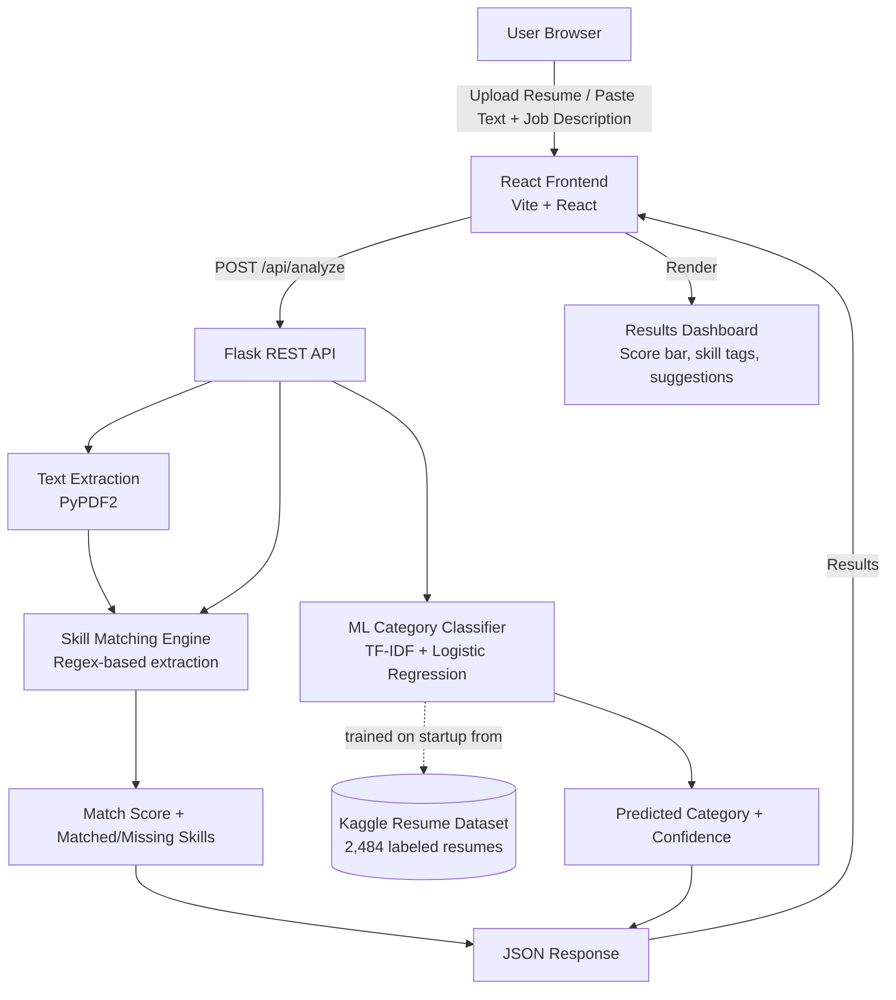

# Smart Resume Analyzer & Job Matching System

## 1. Problem Statement ID
**AI-01**

## 2. Problem Statement Title
**Smart Resume Analyzer & Job Matching System**

## 3. Solution

We built a full-stack web application that analyzes a candidate's resume against a given job description and instantly returns a match score, matched/missing skills, and improvement suggestions — combining rule-based skill extraction with a trained ML classifier.

**How it works:**

1. **Resume Input** — The user either uploads a resume (PDF/TXT) or pastes resume text directly into the app.
2. **Text Extraction** — For PDF uploads, the backend extracts raw text using PyPDF2.
3. **Skill Identification** — Both the resume text and the job description are scanned against a curated dictionary of 80+ technical and soft skills (programming languages, frameworks, databases, cloud tools, soft skills, etc.) using pattern matching.
4. **Job-Description Comparison** — The skills found in the resume are compared against the skills required by the job description to compute:
   - **Match Percentage** = (matched skills ÷ required skills) × 100
   - **Matched Skills** list
   - **Missing Skills** list
5. **AI Resume Category Prediction** — A **TF-IDF + Logistic Regression** classifier, trained on a labeled Kaggle resume dataset (2,484 resumes across 24 job categories), predicts which professional category the resume best fits (e.g., Information Technology, HR, Engineering), along with a confidence score.
6. **Improvement Suggestions** — Based on the missing skills, the system generates actionable suggestions for the candidate to improve their resume/profile for that specific job.
7. **Results Display** — All of the above is rendered on a clean, responsive React dashboard with a visual match-score bar, skill tags, and suggestions panel.

This gives both **recruiters** (quick candidate-job fit screening) and **job seekers** (resume improvement guidance) a fast, explainable AI-assisted tool — built entirely within a 4-hour hackathon window.

## 4. System Architecture



**Flow summary:**
`React UI → Flask API → (PDF Text Extraction + Skill Matching + ML Classifier) → JSON Response → React Results Dashboard`

## 5. Tech Stack

| Layer | Technology |
|---|---|
| Frontend | React 18, Vite, plain CSS |
| Backend | Python, Flask, Flask-CORS |
| Machine Learning | scikit-learn (TF-IDF Vectorizer + Logistic Regression) |
| Data Handling | pandas, NumPy |
| PDF Parsing | PyPDF2 |
| Dataset | Kaggle Resume Dataset (2,484 labeled resumes, 24 categories) |
| API Communication | REST (JSON over HTTP), Fetch API |
| Dev Tools | npm, pip, Vite dev server |

---

## Setup & Run Instructions

### Folder Structure
```
resume-analyzer/
├── backend/
│   ├── app.py, model.py, skills_data.py
│   ├── requirements.txt
│   └── data/UpdatedResumeDataSet.csv
└── frontend/
    ├── package.json
    └── src/ (App.jsx, components/)
```

### Backend
```bash
cd backend
pip install -r requirements.txt
python app.py
```
Runs at `http://localhost:5000`

### Frontend
```bash
cd frontend
npm install
npm run dev
```
Runs at `http://localhost:5173`
